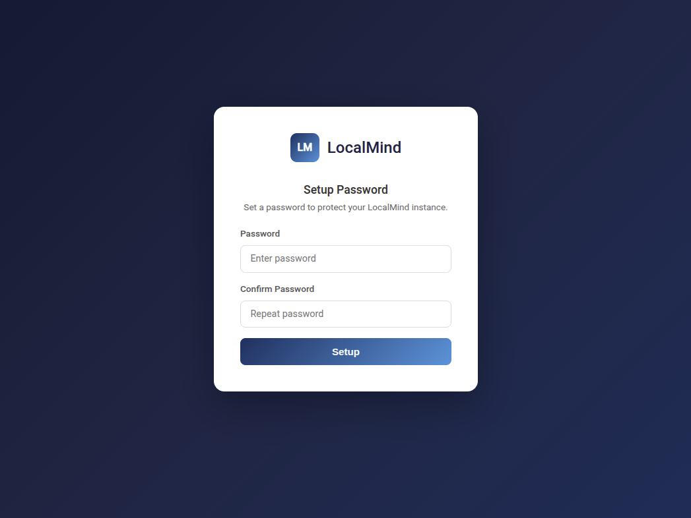
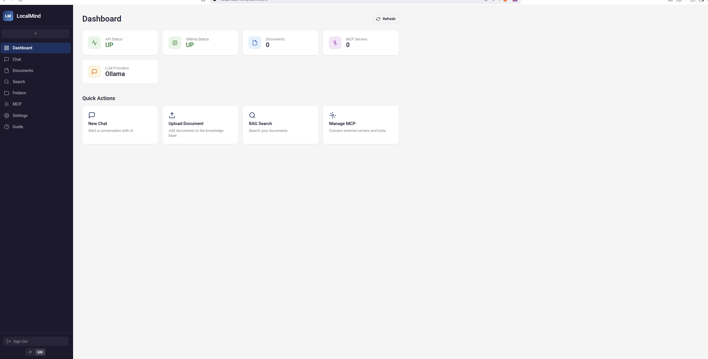
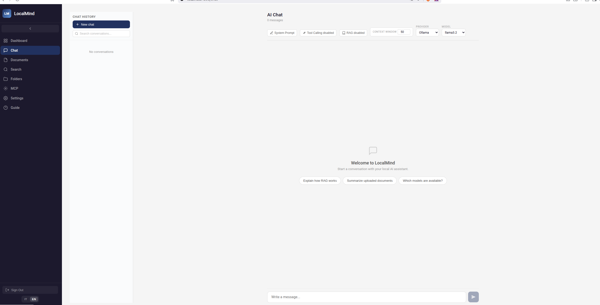
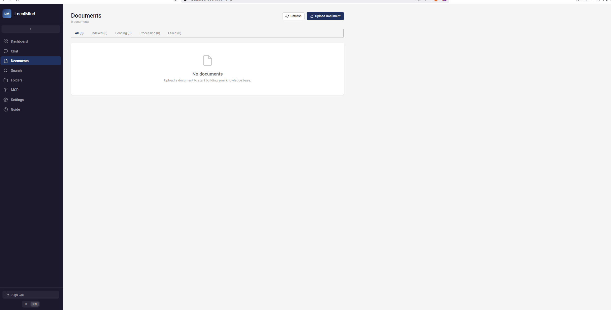
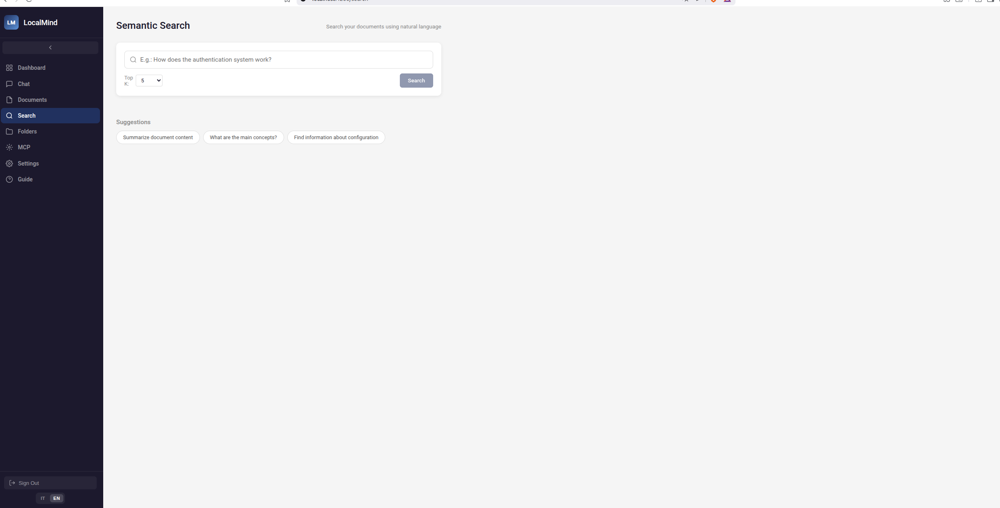
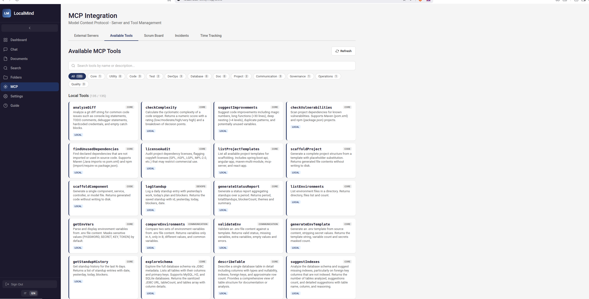
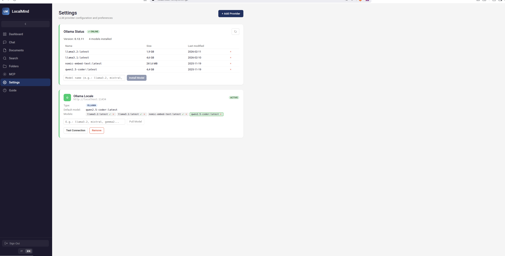
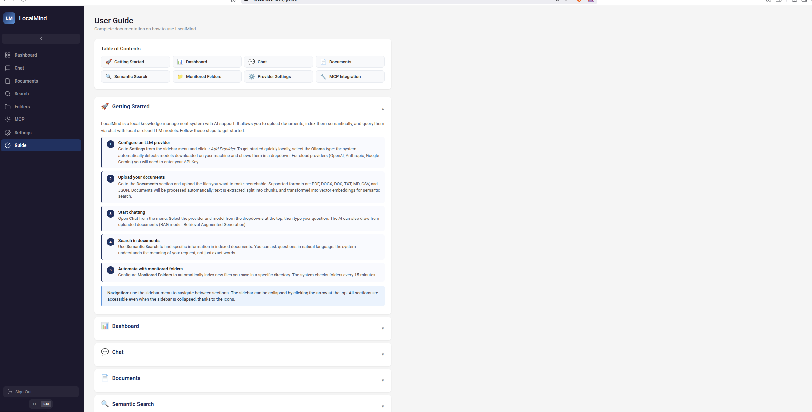

# LocalMind

[](https://github.com/fedcal/localmind/actions/workflows/ci.yml)
[](https://www.gnu.org/licenses/agpl-3.0)
[](https://openjdk.org/projects/jdk/17/)
[](https://angular.dev/)
[](https://spring.io/projects/spring-boot)
[](https://spring.io/projects/spring-ai)

**Your AI, your data, your machine.**

Local-first AI platform for document management, semantic search, and multi-provider LLM chat.

## Screenshots

### Password Setup


### Dashboard - Service status and quick actions


### AI Chat - Multi-provider conversation


### Document Management - Upload and indexing


### Semantic Search - Natural language queries


### MCP Integration - 132+ native tools


### Settings - LLM provider configuration


### Built-in User Guide


---

## Prerequisites

| Requirement | Version | Notes |
|-------------|---------|-------|
| Docker + Compose | v2+ | **Required** for infrastructure services |
| Java | 17+ | Native mode only |
| Maven | 3.9+ | Native mode only |
| Node.js | 22+ | Native mode only |
| npm | 11+ | Native mode only |

## Quick Start

### Option A: Automated Setup (recommended)

```bash
git clone <repo-url> localmind
cd localmind
./scripts/setup.sh
```

The script guides you step-by-step: creates `.env`, starts MySQL/Qdrant/Ollama in Docker, configures the database and downloads AI models.

### Option B: Full Docker (everything in containers)

```bash
git clone <repo-url> localmind
cd localmind
cp .env.example .env
# Edit .env with your settings

# Start everything (infra + backend + frontend)
docker compose --profile full up -d --build
```

### Option C: Manual (developers)

```bash
git clone <repo-url> localmind
cd localmind
cp .env.example .env
# Edit .env with your credentials

# 1. Start infrastructure services
docker compose up -d

# 2. Download Ollama models
./scripts/setup-ollama-models.sh

# 3. Start backend + frontend
./scripts/start-all.sh
```

### Access

- **Frontend**: http://localhost:4200
- **API**: http://localhost:8080/api/v1
- **Health check**: http://localhost:8080/api/v1/dashboard/health

---

## Architecture

```
localmind/
├── localmind-backend/          # Spring Boot 3.4.2 + Spring AI 1.0.0
│   ├── localmind-domain/       # Pure Java logic (zero framework dependencies)
│   ├── localmind-infrastructure/ # Spring adapters (JPA, LLM, Vector Store, MCP Tools)
│   ├── localmind-api/          # REST controllers + DTOs
│   ├── localmind-batch/        # Spring Batch (folder scan, ingestion)
│   └── localmind-app/          # Entry point, Flyway migrations, profiles
├── localmind-frontend/         # Angular 21, standalone components, Signals
├── scripts/                    # Startup scripts
├── documentazione/             # Documentation (Italian)
└── documentation/              # Documentation (English)
```

**Architectural pattern**: Hexagonal (Ports & Adapters). Domain services have no Spring dependencies and are registered as `@Bean` in `DomainConfig.java`.

**LLM Gateway**: Multi-provider routing with configurable fallback chain (OLLAMA -> OPENAI -> ANTHROPIC -> GOOGLE).

---

## Main Commands

### Backend

```bash
cd localmind-backend

# Build all modules
mvn install -DskipTests

# Run with dev profile
mvn -pl localmind-app spring-boot:run -Dspring-boot.run.profiles=dev

# Run tests
mvn test
```

### Frontend

```bash
cd localmind-frontend

npm install
npm start           # Dev server on port 4200
npm test            # Unit tests (Vitest)
npm run e2e         # E2E tests (Playwright)
```

---

## Configuration

Environment variables are defined in `.env` (see `.env.example`):

| Variable | Default | Description |
|----------|---------|-------------|
| `DB_HOST` | localhost | MySQL host |
| `DB_PORT` | 3306 | MySQL port |
| `DB_NAME` | localmind | Database name |
| `DB_USERNAME` | root | Database user |
| `DB_PASSWORD` | - | Database password |
| `SERVER_PORT` | 8080 | Backend port |
| `OLLAMA_HOST` | localhost | Ollama host |
| `OLLAMA_PORT` | 11434 | Ollama port |
| `OLLAMA_CHAT_MODEL` | llama3.2 | Chat model |
| `OLLAMA_EMBED_MODEL` | nomic-embed-text | Embedding model |
| `QDRANT_HOST` | localhost | Qdrant host |
| `QDRANT_PORT` | 6334 | Qdrant port |
| `LLM_DEFAULT_PROVIDER` | OLLAMA | Default provider |
| `OPENAI_API_KEY` | - | OpenAI API key (optional) |
| `ANTHROPIC_API_KEY` | - | Anthropic API key (optional) |
| `GOOGLE_AI_API_KEY` | - | Google API key (optional) |

---

## API Endpoints

All under `/api/v1/`:

| Endpoint | Description |
|----------|-------------|
| `/chat` | LLM chat |
| `/documents` | Document CRUD and upload |
| `/search` | Semantic search |
| `/folders` | Folder monitoring configuration |
| `/settings/providers` | LLM provider management |
| `/mcp/servers` | MCP server management |
| `/mcp/tools` | MCP tool execution |
| `/models` | List available models |
| `/dashboard/health` | Health check |

---

## Testing

| Suite | Framework | Tests | Command |
|-------|-----------|-------|---------|
| Backend Unit | JUnit 5 + Mockito | ~500 | `cd localmind-backend && mvn test` |
| Frontend Unit | Vitest | - | `cd localmind-frontend && npm test` |
| E2E | Playwright | 67 | `cd localmind-frontend && npm run e2e` |

---

## Native MCP Tools

LocalMind natively integrates 132+ MCP tools organized in 9 classes:

| Class | Tools | Functionality |
|-------|-------|---------------|
| LocalMindUtilityTools | 13 | Regex, HTTP client, snippets |
| LocalMindCodeTools | 9 | Code review, dependency analysis, scaffolding |
| LocalMindTestTools | 6 | Test generation, performance profiling |
| LocalMindDevOpsTools | 12 | Docker, log analysis, CI/CD monitor |
| LocalMindDatabaseTools | 8 | Schema explorer, mock data generator |
| LocalMindDocTools | 8 | API documentation, codebase knowledge |
| LocalMindProjectTools | 31 | Scrum, agile metrics, time tracking |
| LocalMindCommTools | 8 | Standup notes, environment manager |
| LocalMindOpsTools | 37 | Access policy, incident manager, workflow |

---

## License

This project is licensed under the [GNU AGPL v3](LICENSE).
